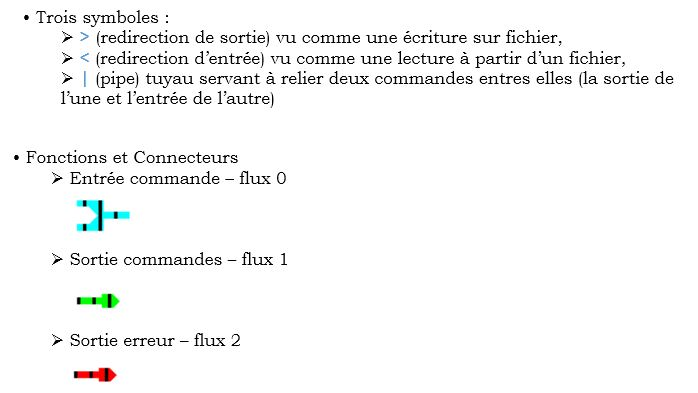
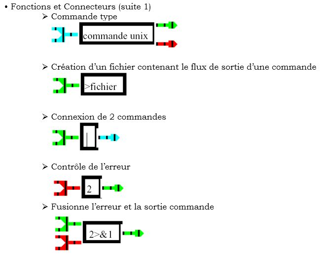
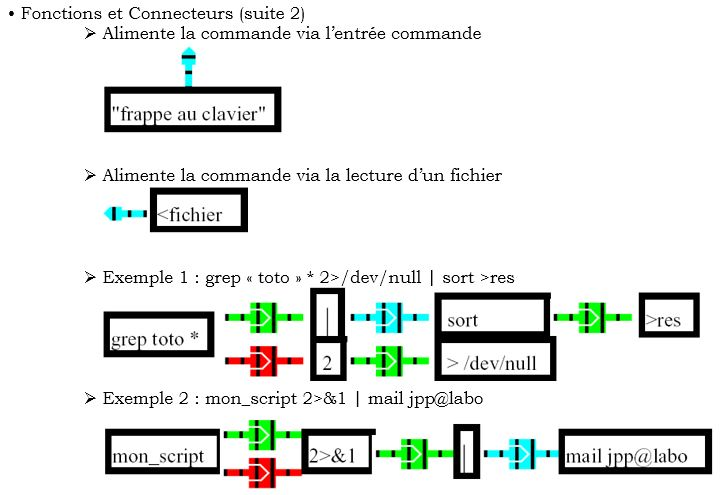
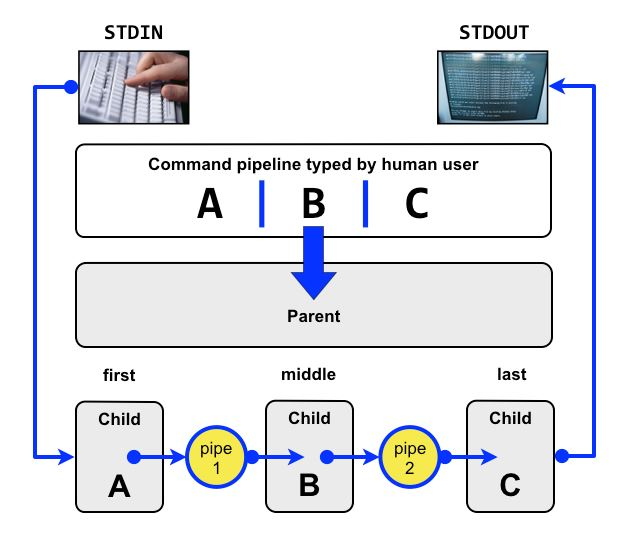

# Théorie des commandes

---

## Structure

Un **commande** est en fait un ==programme compilé==, souvent en C, accessible partout dans l'OS.  
Comme tout programme classique, il peut recevoir des paramètres de l'extérieur.  
Dans l'IC, on a cette structure

```bash linenums="1"
nom_de_la_commande param1 param2 param3 ...
```

!!! tip 
    La commande est chacun de ses paramètres sont séparées par des **ESPACES**
    
---

## Gestion des Flux

### Théorie







### Exemples

```bash linenums="1"
cat < toto

ls > dir.txt

ls >> dir.txt

rm * 2> erreur.log

rm * 2>> erreur.log

ps –ef|grep toto

```

---

## Résumé





---

## Où trouver l'information ?

Quand on a accès à internet, la meilleure source et la plus rapide : Google :wink: !
Sinon, n'hesitez pas à utiliser la commande ``man nom_de_la_commande`` qui décrit précisement toutes les possibilités d'une commande.

!!! tip
    Les pages manquantes d'un manuel peuvent être ajoutées...  
    On peut aussi traduire le ``man`` en français :wink:  
